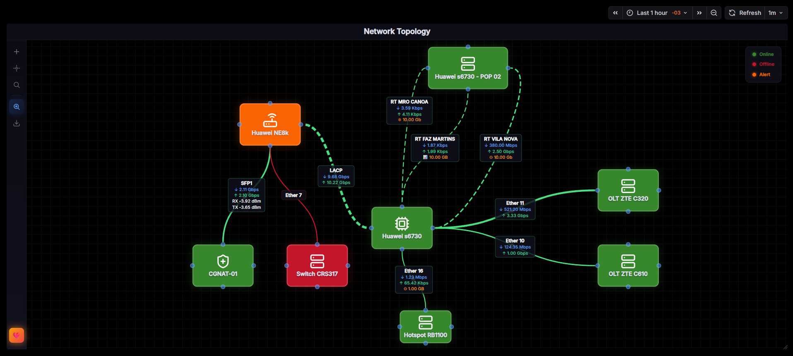
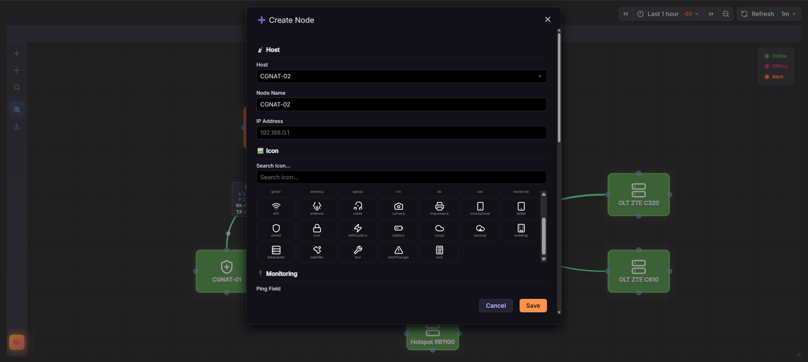
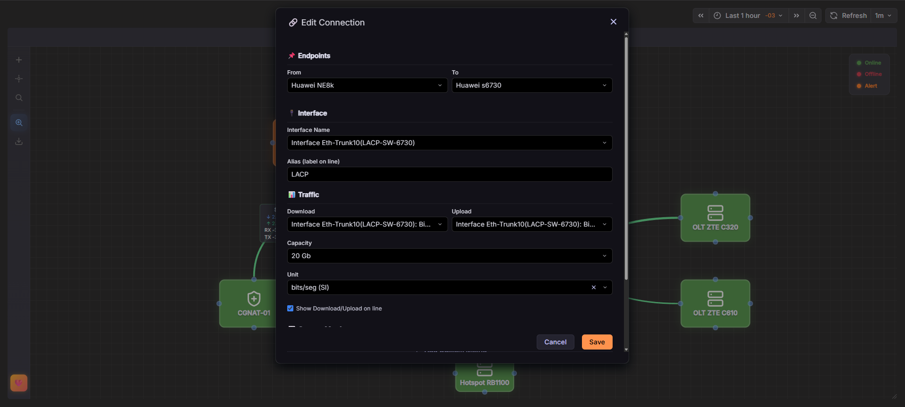
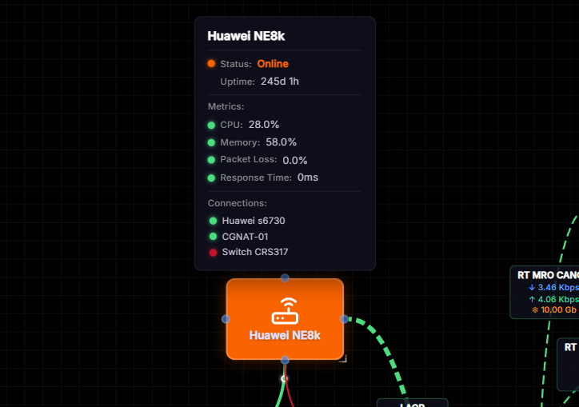
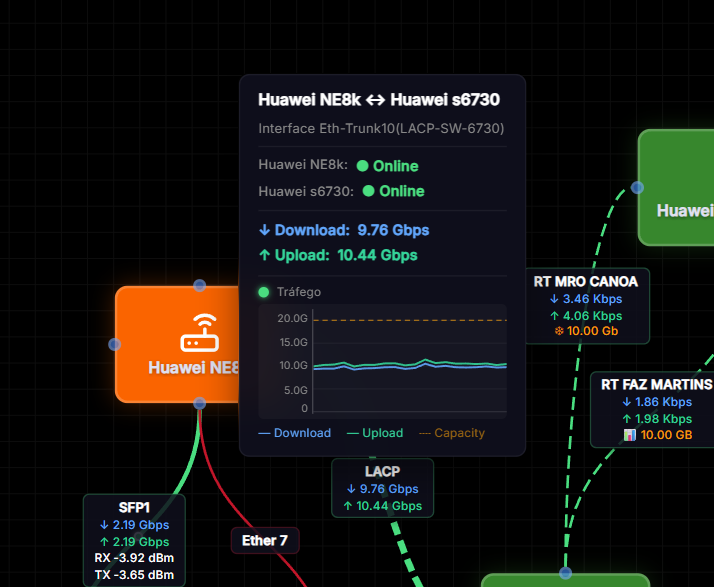
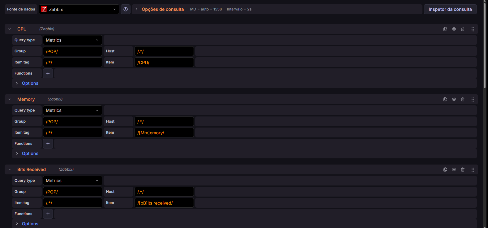
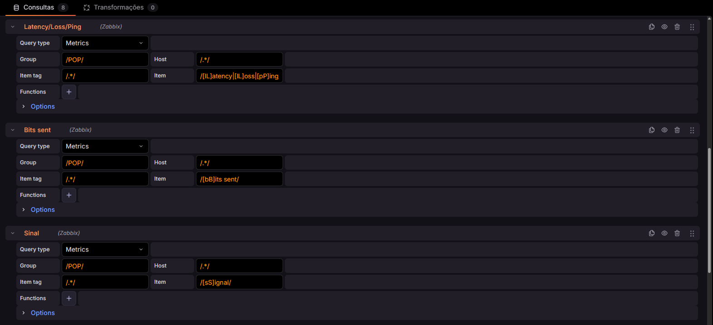
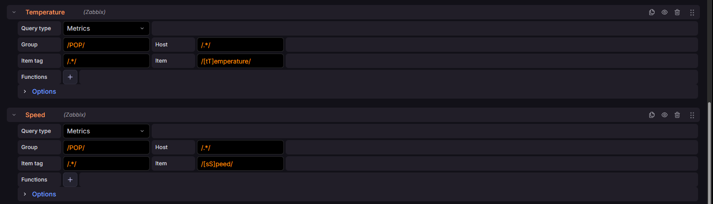

# NSW Topology — Topologia de Rede pro Grafana

> 🇺🇸 [Read in English](README.md)

Plugin de painel pro Grafana que renderiza mapas de rede interativos com dados em tempo real.



---

<div align="center">

### ☕ Curtiu o plugin? Me ajuda com um café

Manter um projeto open-source dá um trabalho danado. Se o NSW Topology te ajudou de alguma forma, qualquer contribuição é bem-vinda e me ajuda a continuar evoluindo o projeto.

[](https://www.paypal.com/donate/?business=Z9USFAAMBJ29S&no_recurring=0&item_name=Developing+the+Network+Topology+plugin+for+Grafana+to+solve+real+monitoring+issues.+Help+me+keep+the+project+evolving%21&currency_code=BRL)

**Valeu! ❤️**

</div>

---

## Pra que serve

Basicamente, ele transforma um painel do Grafana num mapa de rede onde você arrasta os nós, conecta com links e tudo atualiza ao vivo com os dados do Zabbix (ou outro data source que retorne séries temporais).

O que dá pra fazer:

- Arrastar e soltar nós com hosts detectados automaticamente do data source
- Links estilo weathermap — muda de cor conforme a utilização (verde → amarelo → vermelho)
- Sparkline de tráfego ao passar o mouse nos links
- Métricas customizadas por nó e por conexão (CPU, memória, sinal, latência, o que quiser)
- Regex pra buscar campos de métrica
- Alertas com threshold de cor configurável
- Status do nó (online/offline) baseado em qualquer campo
- Backup e restore, com importação de backup da v1
- Aparência 100% customizável — ícones, cores, tamanhos, grid

## Prints

### Adicionando um nó

Seleciona o host, e o plugin já detecta as métricas disponíveis e pré-preenche.



### Configurando uma conexão

Escolhe a interface, define download/upload, capacidade, e estilo da linha.



### Tooltip do nó

Passa o mouse em cima de um nó pra ver status, uptime, métricas e conexões.



### Tooltip da conexão

Passa o mouse no link pra ver tráfego, métricas e o sparkline do histórico.



## Instalação

### Grafana CLI

> ⏳ **Em breve** — ainda não submeti o plugin pro catálogo do Grafana.\
> Por enquanto usa a instalação manual ou Docker.

```bash
# Quando disponível:
grafana cli plugins install gabrielnsw-nswtopology-panel
sudo systemctl restart grafana-server
```

### Manual

1. Baixa a última release no [GitHub Releases](https://github.com/gabrielnsw/nsw-topology/releases)
2. Extrai na pasta de plugins do Grafana (`/var/lib/grafana/plugins/`)
3. Reinicia o Grafana

### Docker

> Documentação Docker por [@marcelobaptista](https://github.com/marcelobaptista)

#### Com `docker run`:

```bash
docker run -d -p 3000:3000 --name=grafana \
  -e "GF_PLUGINS_PREINSTALL=custom-plugin@@https://github.com/gabrielnsw/nsw-topology/releases/download/v2.0.1-beta/gabrielnsw-nswtopology-panel-2.0.1-beta.zip" \
  -e "GF_PLUGINS_ALLOW_LOADING_UNSIGNED_PLUGINS=gabrielnsw-nswtopology-panel" \
  grafana/grafana
```

#### Com `docker compose`:

```yaml
services:
  grafana:
    container_name: grafana
    image: grafana/grafana
    restart: unless-stopped
    environment:
      - GF_PLUGINS_ALLOW_LOADING_UNSIGNED_PLUGINS=gabrielnsw-nswtopology-panel
      - 'GF_PLUGINS_PREINSTALL=custom-plugin@@https://github.com/gabrielnsw/nsw-topology/releases/download/v2.0.1-beta/gabrielnsw-nswtopology-panel-2.0.1-beta.zip'
    ports:
      - '3000:3000'
    volumes:
      - 'grafana_storage:/var/lib/grafana'
volumes:
  grafana_storage: {}
```

```bash
docker compose config   # valida
docker compose up -d    # sobe
```

> **Nota:** Estes exemplos usam a versão `v2.0.1-beta`. Lembre-se sempre de trocar para a tag da versão mais recente nas próximas instalações!

## Configuração do data source

Funciona melhor com **Zabbix** (via [plugin do Alexander Zobnin](https://github.com/alexanderzobnin/grafana-zabbix)), mas qualquer data source que retorne séries temporais com labels de host/campo serve.

### Exemplos de queries Zabbix







## Como usar

1. Cria um painel e seleciona **NSW Topology**
2. Configura as queries do data source (veja os exemplos acima)
3. Clica no **+** na sidebar pra adicionar nós
4. Arrasta de um handle até outro nó pra criar conexões
5. Botão direito em qualquer nó ou conexão pra editar/deletar
6. Sidebar tem backup, busca e configurações

## Requisitos

- Grafana **10.0+**
- Node.js **22+** (só pra desenvolvimento)

## Build

```bash
git clone https://github.com/gabrielnsw/nsw-topology.git
cd nsw-topology
npm install
npm run dev    # watch mode
npm run build  # produção
```

## Licença

[Apache 2.0](LICENSE)

## Agradecimentos

- [@marcelobaptista](https://github.com/marcelobaptista) — documentação da instalação via Docker
